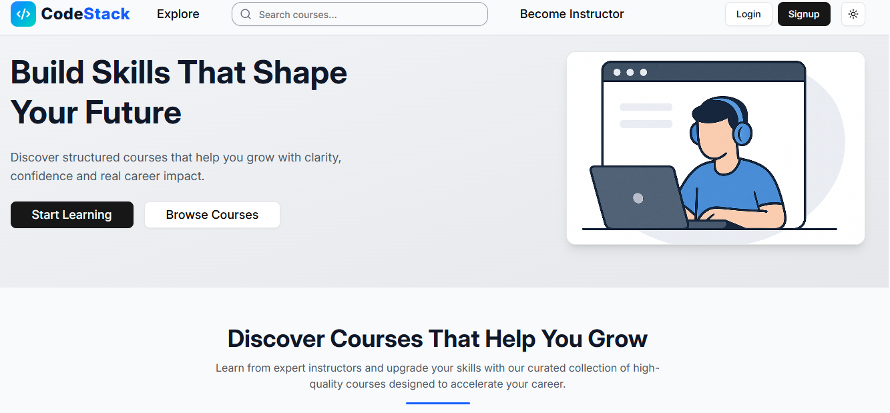

# CodeStack – Frontend (React)

CodeStack Frontend is the UI for the LMS platform. It provides a clean and responsive experience for students and instructors.

## Live Link

https://lms-app-frontend-beta.vercel.app/

## Tech Stack

React, Redux Toolkit, RTK Query, Tailwind CSS, ShadCN UI, React Router, Axios

## Features

- User Authentication (JWT)
- Student & Instructor Dashboards
- Course Purchase & Transactions
- Video Player
- Course Progress
- Search & Filters
- Profile Management
- Light/Dark Mode
- Certificate Download
- Dashboard Charts
- Responsive UI

## Screenshots

## Clone

git clone https://github.com/Abhishek-sharma-project/lms-app-frontend
cd frontend

## Install

npm install

## Environment

Create a `.env` file:  
VITE_BACKEND_URL=https://lms-backend-s4fp.onrender.com

## Start

npm run dev

## Author

Abhishek Sharma – Full Stack Developer
